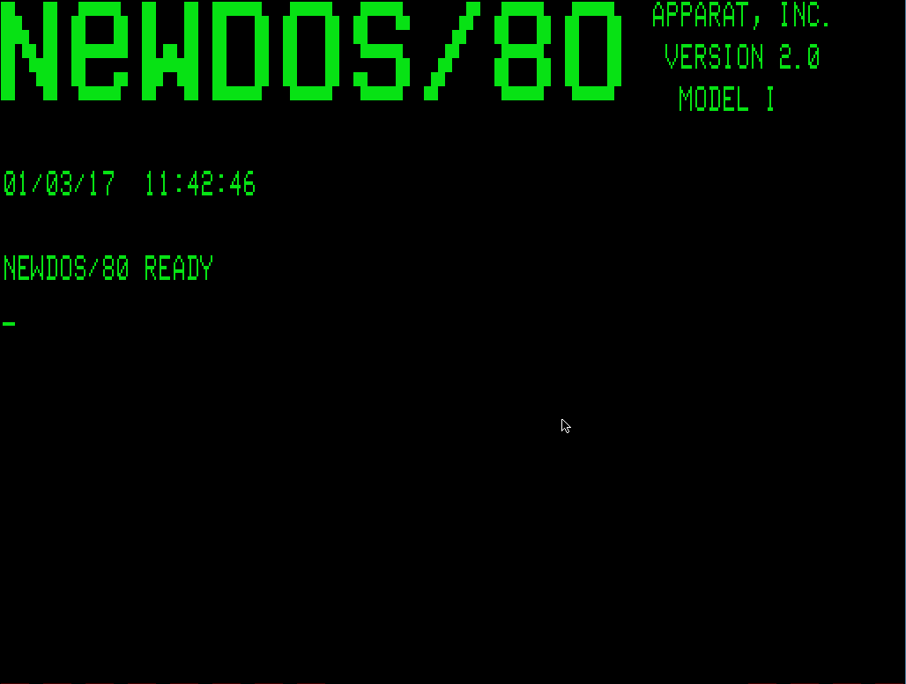

# Trek14: Star Trek for the TRS-80

## Introduction

_TREK14_ is a newly developed "classic star trek" game for the [TRS-80](https://en.wikipedia.org/wiki/TRS-80), inspired by the originals, but with new ideas.

The graphics are retro and blocky, just like the originals.



## How To Run

### Model 1 Cassette 
The binary `TREK14.CAS` is a trs-80 model I SYSTEM CAS file, to be loaded through the cassette interface. Load using the following commands:

    SYSTEM (enter)
    *? (press T enter)

The program will load with flashing asterisks in the top right corner.
at the next `*?` prompt type `/` (enter).

### Model 1 DOS
`go1.bat`

At the command prompt type, `TREK14`


### Model 3
`go3.bat`

At the command prompt type, `TREK14`

### Model 4/4P
`go4.bat`

At the command prompt type, `TREK14`

## How To Play

Your mission is to **boldly**:

* Explore the galaxy
* Destroy the 50 Klingons
* Find the 5 class M planets

Before star date 2100.

The galaxy is a 8x8x3 (x,y,z) grid of 192 quadrants, each of which is subdivided into 64x14 sectors, corresponding to the X and Y screen position.

Along with Klingons, there are also Federation bases where you can refuel, as well as planets and stars.

Star Fleet HQ is in the bottom corner of the galaxy at 772. This is also where you start the game. If you dock with _this_ star base, game is ended, so _only do this if you with to finish the game and receive your evaluation_.


## Short Range Scan

Press "S" from the command menu.

The short range scan is the main display of the current quadrant, for movement and tactical combat.

Your ship can move on impulse engines left, right, up and down using the arrow keys. You can access most of the commands directly from this screen by just pressing their command letter. Impulse movement takes one unit of energy and takes one unit of time. An extra 10 units of energy is consumed during red alert.

Red alert and shields are automatically engaged when enemies are in your quadrant.

You can scan enemies from within the short range scan by pressing "S". This will show you how much energy they have. However, this takes a turn and those enemies will have another chance to move or attack.

You can dock with bases to refuel by manoeuvring adjacent and pressing "D". This will also replenish your photon torpedoes. A maximum of 3 can be carried at any one time.

You can also move into planetary orbit. Position adjacent to a planet and press "D".

_Kirk's tip:_
> Keep a sharp lookout for rare Earth-like "M" planets. Orbit these so Mr. Spock can scan them. 


## Long Range Scan

Press "L" for long range scan.

The long range scan shows a 3x3x3 quadrant view of entities centred around your current location. So, for example, if you're at (1,1,1) you will see quadrants in the range (0-2, 0-2, 0-2). Quadrants outside the galaxy are displayed as "VOID" and are inaccessible, as they are outside the galaxy.

The long range scan shows a summary of content in each quadrant, For example:

    F1S1P2

Means, 1 *Federation* vessel, 1 *Star* and 2 *Planets*. Other codes are K for Klingons and B for bases.

You can use arrow keys within long range scan to pan around. But only the _currently known_ galactic content will be available. Areas not yet scanned will be displayed as "????". Panning the Long Range Scan always renders the view from the middle Z plane (ie X,Y,1).

_Kirk's tip:_
> Be sure to locate a nearby base _before_ going into battle. Use the long range scan movement arrows to remind you where the base is when you want to warp out.


## Warp Drive

Press "W" from the command menu or from short range scan.

Warp drive can be used to move from one quadrant to another, it is quicker than impulse engines but uses more energy. It takes one unit of time to warp each quadrant but 100 units of energy.

You can also cross quadrant boundaries on impulse engines my moving manually, but it is slower.

When prompted for the location enter the three coordinates X, Y, Z either separated by commas or as one number XYZ, eg 772.

_Kirk's tip:_
> If you try to exit a quadrant on impulse, but you can't move, there might be something stopping you.


## Klingons

Klingons cluster in bunches of 1 to 4. Their ships are smaller and have less energy capacity than a starship. They have no photon torpedoes and rely wholly on phasers for weapons. Klingons can manoeuvre slightly better on impulse engines and can move diagonally; they can close on a ship quite fast.

Klingons never retreat but they do fall back sometimes to recharge. This is possible when a quadrant has a star. The Klingons can slowly recharge from the star's energy, then later come in for another attack.

Some Klingon ships are slightly bigger and have more energy, but are still inferior to a starship.

_Kirk's tip:_
> The Klingons have developed a technology to recharge from stars, but you cannot. Act quickly to dispatch them before they restore their energies. Some stars are more powerful than others.


## Phasers

Press "P" from the command menu or from the short range scan.

Phasers automatically lock on to sufficiently near enemy targets. You are prompted for the amount of energy to deploy to phasers. The phasers will fire at _all_ enemies within the quadrant that are in direct line of sight, _each one consuming the specified energy_, providing it's available.

Be sure not to deplete too much energy during a phaser attack. It can leave your ship vulnerable and unable to escape.

The damage potential of phasers decreases with distance according to an exponential decay law, so that the power emitted may be as little as 10% across the width of a quadrant.

Klingons will tend to close rapidly for attack, fire at close range, then move back somewhat, so as to inflict the most damage on their foe.

_Kirk's tip:_
> Use "S" to scan enemy energy levels, and use phasers in close proximity for maximum devastation.


## Photon Torpedoes

Press "T" from the command menu or from the short range scan.

You can carry at most 3 photon torpedoes at any time. Torpedoes are very powerful and will often destroy an enemy ship in a single hit. Unlike phasers, the damage potential of torpedoes does not decrease with distance, so it's the ideal weapon to pick off an enemy before it gets close. However, enemies will try to dodge the torpedo if they see it coming.

Torpedoes do not aim themselves, you have to manually aim them by setting their direction. The direction is entered as a bearing in degrees from 0-360, where 0 points directly ahead of your ship.

Note that your photon torpedoes are launched from the _front_ of the Enterprise, bear this in mind when calculating your launch angle.

direction chart:


                         90
            135          |           45
              \          |          /
                \        |        /
                  \      |      /
                    \    |    /
                      \  |  /
                        \|/
    180 ---------------- o ---------------- 0
                        /|\
                      /  |  \
                    /    |    \
                  /      |      \
                /        |        \
              /          |          \
             225         |          315
                        270


Be careful when aiming photon torpedoes because, if you miss, you might destroy a non-enemy object - which can result in court martial!

Be wary of that old Klingon trick, to place itself between you and a star or planet, dodge the attack and have you hit the planet!

_Kirk's tip:_
> Manoeuvre to get two enemies lined up and fire! If the nearest dodges, you'll get the one behind!


## Bases

There are 10 Federation bases in the galaxy, 9 of which you can dock to refuel and spent photon torpedoes are replenished. To dock, manoeuvre your ship adjacent to the base and press "D".

Note that the base in quadrant 7,7,2 should **NOT** be docked, unless you wish to end your mission. This base is star fleet HQ, docking there voluntarily ends the mission giving your report and score.

If the star date reaches 2100, you will be recalled to HQ. If this happens, do not delay as it can adversely affect your score. Hurry back to HQ for your final review.

_Kirk's tip:_
> If you're recalled to star fleet, but delay too long, Spock has authority to assume command.


## Damage

The impact energy of an enemy blast must be absorbed. Ideally this energy is absorbed by your shields which take the impact energy cost from your ship's energy banks. If this energy is more than your reserves, you are destroyed.

The capacity of your shields to absorb energy depends on their strength. Fully charged shields can absorb about half the total energy of a Klingon warship. However, depleted shields take time to recharge.

The Shield strength is shown on the top of the short range scan as "S"

Any excess impact energy over the strength of your shields results in damage to the ship. Any of the operations can be affected; scanners (both long and short range), movement including the warp drive and impulse engines as well as your ability to retaliate with photon torpedoes and phasers.

For example, if the impulse engines are damaged, you cannot move around the quadrant until they are repaired - you are a sitting duck!

Worse still is if the short range scanner are inoperative. In such a case you are totally blind. The scan shows an empty quadrant, with all positions unknown.

Your engineering crew will work hard to restore damaged operations. They give priority to fixing your tactical display and impulse movement.

Tactical combat is the crux of the game and the proving grounds of the competent captain.

_Kirk's tip:_
> If you've got a Model 4 (like me), the ship's operational levels are displayed in the right sidebar. Otherwise use the "D" command from the main menu to display a damage report and your current score.


## Ship's Computer

Press "C" from the command menu.

As you explore the galaxy, information from the long range scan is accumulated in the ship's memory banks.

You can search those memory banks for known locations of enemies or bases. For example, if you are low on energy and need to refuel at the nearest known star base, you can us the ship's computer to list all bases discovered.

Helpfully, the computer will tell you the closest base or enemy.

## Replay

Each galaxy has a code number. You'll be told this at the start, when the galaxy is generated and also when the game is over.

If you wish to replay the _same_ galaxy, run the game with this galaxy code as input parameter on the command line;

eg;
`TREK14 1234`

Will run galaxy 1234.

## Tactics

_Kirk Says:_

> Be competent at the photon torpedo aiming angle. Whatever you do, make sure you do not accidentally hit a planet, star or base.

> Klingons will often manage to dodge a torpedo fired across a distance. Sometimes however there is no dodge space for them in which case they can't move. Alternatively if there are two Klingons on the same line, only 1 will manage to dodge.

> If there is a star in the quadrant, after an attack, Klingons will approach the star and collect energy. In such cases, try to head off the Klingon or destroy it before it can recharge.

> Klingons will navigate around obstacles as part of their attack.

> You can cross quadrant borders using the arrow keys (impulse engines). If you are losing a battle (esp if warp is damaged), you can retreat across the border. Klingons won't pursue you (yet).

> Always go into battle against 3 or more Klingons with a full set of torpedoes.

> Do not use phasers until enemies are close, the energy depletion with distance will otherwise result in a lot less damage.

> Systematically explore the galaxy by navigating in the Z=1 plane, ie (X, Y, 1). Good positions are eg (1,1,1), (6,6,1), (3,6,1) and so on that will long range scan a lot of nearby quadrants and collect a lot of data.

> Orbit class M planets, they look a bit different.

> _Good Luck!_

----


## Compiling Trek14

The project is completely free and open source, hosted on github,
http://github.com/voidware/trek14

Get your copy of the source repo with,

    git clone https://github.com/voidware/trek14.git

The project compiles using the Small Device C Compiler (SDCC), which is free and open source, http://sdcc.sourceforge.net

Download and install the SDCC binaries and you're ready to go!

The build uses make, for windows install mingw64.

To build;

edit `makefile` and change the first line to the location of your installed `sdcc` eg;

```
SDCCDIR = d:/sdcc
```

Then `make` should work.

SDCC generates Intel HEX format "binaries". These are converted to TRS80 CAS format. There is a utility in tools/mksys that performs this conversion. There is a windows mksys.exe compiled binary for convenience, otherwise you'll have to compile the mksys.cpp program yourself - which is only the one file with no dependencies.

The conversion from IHX to CAS is done automatically by the makefile using this  mksys utility.

## Game Design, Motivation and Ideas for v2

The game is based on Star Trek 3.5 by Lance Micklus, originally for the TRS-80, which was one of the best implementations for the time.

This "remake" has been done to have a similar flavour, but also as an attempt to improve the original gameplay. 

TREK14 has a 3D galaxy (X,Y,Z) of size (8,8,3) totalling 192 quadrants. 

Most (all?) of the "classic" Star Trek games represented the galaxy by storing the contents of each quadrant. TREK14 represents the galaxy the other way around; it has a list of entities, their location and properties rather than a list of quadrants.

This is one of the new ideas for trek14 and a deliberate departure from the classic design. The purpose of this is so that the contents of any quadrant is not hard limited and, most importantly, that the layout of entities (and their properties) within a given quadrant is not mysteriously "forgotten" when you return to that quadrant later.

For example, if you flee during combat to a neighbouring quadrant, then return to continue the fight, the positions and combat states of the enemies within that quadrant are not "reset". This was a gameplay weakness of the originals.

Each entity together with its state is packed in a 5 byte entity record (see ent.h for bit banging details). Approx 2K is reserved for the representation of the galaxy in this format (400 max entities * 5 = 2000 bytes).

One reason this format was not chosen by classic BASIC variants, is that scanning a 400 element table would be too slow in BASIC. TREK14 is a machine code program and manages to scan the table fast enough for purpose (even at 1.77Mhz).

### Klingons

The galaxy has 50 Klingon warships, randomly positioned with initially a max of 3 per quadrant. 

_For v2;_ Enemies can call in others from adjacent quadrants to bolster their attack.

_For v2;_ There are currently two Klingon ship classes, plan to introduce a Klingon "Destroyer" which will be larger than the Enterprise. This can only be defeated after gaining technology upgrades, or perhaps in (temporary) collaboration with the Romulans.

### Romulans

_For v2;_ Can side with the Klingons or the Federation depending on diplomacy. Oh yeah, and who you happen to hit with a stray photon torpedo!

### Bases & Federation Ships

There are 10 star bases across the galaxy, 9 where you can refuel and restock depleted photon torpedoes (only a max of 3 can be carried). Additionally Star fleet HQ is located in the galaxy far corner 772. 

_For v2_; Other Federation ships may be encountered in the galaxy. Sometimes these come under enemy attack and call for your assistance. Sometimes, they may even help you fight the Klingons.

### Beaming down to Planets

_Planned for v2_;

Currently, you can only orbit M-Planets. In v2, you can "beam down" and play a mini-game.

Winning the mini-games will give you new technologies such as;


* Expanded photon torpedo capacity
* Cloaking devices
* Phaser upgrades
* Extra energy banks
* Upgraded shields
* Enhanced warp capacity (eg hyperspace command)
* Deeper long range scan
* The Corbomite manoeuvre (one-shot escape or smart bomb?)

## Model 4/4P

Takes advantage of 80 column mode. Although the quadrant is the same size, the ships operational systems are displayed on the right sidebar.

Unfortunately, due to limitation of the 4/4P graphics, the lower edge of the sprite pixels are stunted, which makes the sprites somewhat asymmetric.

_For v2_; work is underway to support the high-res Grafyx card on the M4. Hopefully we can have high-res game spites!!


